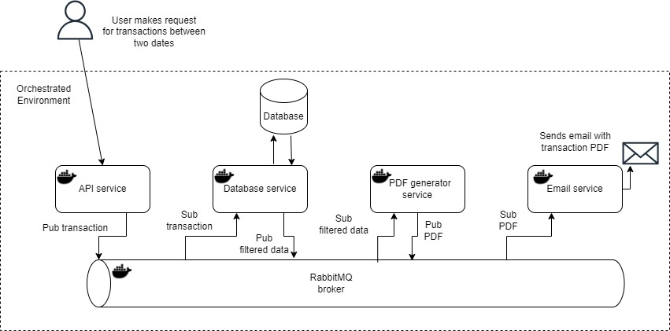

# Bank Statement Generation - Solution Documentation

## Overview

This document provides an overview and detailed information about my solution for the Bank Statement Generation project. The project involves creating services to generate a PDF file of user transactions based on a specified date range and sending it to the user via email.

## Services

### 1. API Service

- Exposes a web API to accept user requests.
- Accepts parameters: `startDate`, `endDate`, and `email`.
- Language/Framework: Node.js with TypeScript.
- Containerization: Docker.

### 2. Database Service

- Manages transaction data stored in a CSV file.
- Reads the CSV file and filters data based on API requests.
- Language/Framework: Node.js with TypeScript.
- Containerization: Docker.

### 3. PDF Generation Service

- Generates a PDF file from the filtered transaction data.
- Constructs a table representing transactions.
- Language/Framework: Node.js with TypeScript.
- Containerization: Docker.

### 4. Email Service

- Sends the generated PDF file as an attachment to the user's email.
- Language/Framework: Node.js with TypeScript.
- Containerization: Docker.

## Implementation Details

### Why Node.js and TypeScript?

I chose NodeJs for its non-blocking, event-driven architecture, making it well-suited for handling asynchronous tasks like reading CSV files and sending emails. I used TypeScript for static typing, improving code maintainability, and catching potential issues during development.

### Why Docker?

I employed Docker for containerization, providing a consistent environment across different platforms. It simplifies the deployment process, enhances scalability, and isolates services, preventing conflicts between dependencies.

### Why RabbitMQ?

I used RabbitMQ as the message broker to enable communication between services. It follows the message queuing pattern, ensuring reliable message delivery and decoupling services. This enhances scalability and fault tolerance.

## Set Up and Installation

### 1. Node.js and TypeScript

- Install Node.js and npm: [Node.js Official Website](https://nodejs.org/)
- Install TypeScript globally: `npm install -g typescript`

### 2. Docker

- Install Docker: [Docker Official Website](https://www.docker.com/)

### 3. RabbitMQ

- Install RabbitMQ: [RabbitMQ Installation Guide](https://www.rabbitmq.com/download.html)

### Service Installation

1. Clone the repository:

   ```bash
   git clone https://github.com/TekyRey/Bank-Statement-Generation.git
   cd Bank-Statement-Generation

2. Build and run each service using Docker:

   ```bash
   docker-compose up --build
This command will build and start the services defined in the docker-compose.yml file.

## Running the API

The API service is responsible for receiving requests and triggering the bank statement generation process. Follow these steps to run the API:

1. The API will be accessible at http://localhost:3000/api/generate-statement. You can use tools like Curl or Postman to send POST requests 
   to this endpoint with the required     
   parameters (start date, end date, and email) to trigger the bank statement generation process.
   
   Example using curl:

    ```bash
    curl -X POST http://localhost:3000/api/generate-statement \
    -H "Content-Type: application/json" \
    -d '{"startDate": "2023-01-01", "endDate": "2023-01-31", "email": "example@example.com"}'


### Note: Ensure that the RabbitMQ, database service, and PDF generation service are running before triggering the API. 


### Bonus: Authentication and Authorization

To enhance security, authentication, and authorization can be implemented:

Authentication: Utilize OAuth2 or JWT-based authentication in the API service. This ensures that only authorized users can access the API.

Authorization: Implement access control mechanisms to restrict access to specific services. For example, use API keys or access tokens for communication between services, ensuring that only valid requests are processed.

### Conclusion

This solution leverages Node.js, TypeScript, Docker, and RabbitMQ to create a scalable, decoupled system for generating and delivering bank statements. The provided set-up instructions facilitate easy deployment, and the bonus section outlines steps for enhancing security through authentication and authorization.


